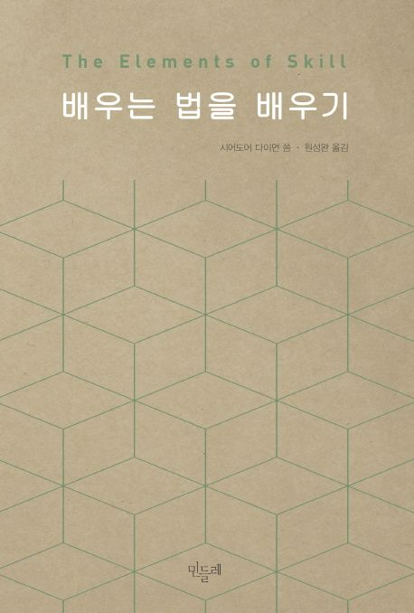

# UNSEEN-BookClub

UNSEEN 2기에서 진행하는 2차 스터디그룹입니다.

## Goal

[배우는 법을 배우기](https://product.kyobobook.co.kr/detail/S000001402652)

## What?

1. 매 주마다 정해진 분량을 읽습니다.
2. 읽은 내용을 바탕으로 논의 사항을 작성합니다.
3. 이후 정해진 시간에 논의 사항으로 토론을 진행합니다.

## Why?

UNSEEN이라는 공동체 학습에서 더 효과적으로 배울 수 있는 법을 같이 논의하고자 합니다. 배우는 법을 배우기라는 책은 지금까지 배워온 방식이 아닌 야생학습에 가까운 학습을 어떻게 하면 더 효과적으로 할 수 있을까에 대한 내용을 담고 있습니다.

같이 UNSEEN에서 더 효과적으로 스스로 학습하는 방법을 고민하고 한가지를 마무리 할 수 있는 스터디입니다.

*4주라는 짧은 시간에 적합한 분량의 책으로 약 200쪽 분량의 책입니다. (책이 작아서 보통 책의 140쪽 분량)*

## How?

- 매주 2개의 챕터를 읽고 정리합니다. (개인의 방식으로)
- 해당 내용을 논의 전날에 공유합니다.
- 공유된 내용에는 필수적으로 논의사항이 들어갑니다.
- 공유된 내용을 바탕으로 정해진 날에 온라인 토론을 진행합니다.

## Reference

- [AcademicConference](https://github.com/ThinkAboutSoftware/AcademicConference)
- [BRIDGE_BookClub](https://github.com/BRIDGE-DEV/BRIDGE_BookClub)